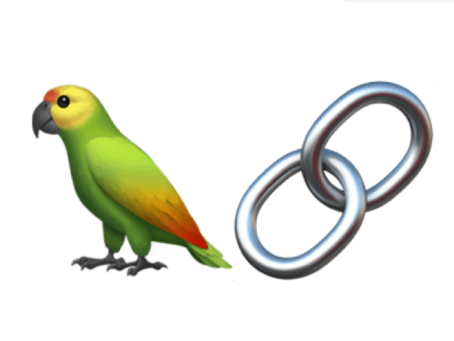

# HumorChat

> Is a chatbot that generates humorous answers to the users query. Built for fun. Can be consumed through an API, that can be integrated onto the target systems. Ease of use is another factor that I wanted to depict through this simple fun project!

### Built using below :
***

   
   

***
>Things I will be updating soon!
>> - Dockerfile (for containerizing the project)
>> - Setting up steps
>> - Environment variable
>> - how to use!
