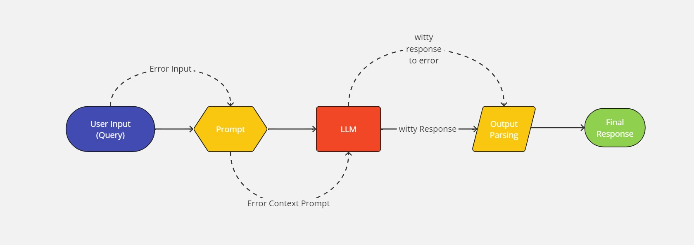

# Humor Chat

The Humor Chatbot API is a playful project designed to inject humor into everyday interactions. Built for entertainment purposes, this chatbot generates witty and amusing responses to user queries, adding a lighthearted touch to conversations. Accessible through a user-friendly API, developers can easily integrate the chatbot into their target systems, enhancing user experiences with a dash of humor.

## Project Design 



## Key Features:

***Witty Responses***: The chatbot generates clever and humorous answers to user queries, providing a delightful experience for users seeking entertainment.

***API Integration***: The chatbot is exposed through a simple API, allowing developers to seamlessly integrate it into their applications, websites, or chat platforms.

***Ease of Use***: Designed with simplicity in mind, the API offers straightforward endpoints and documentation, ensuring ease of integration and usage for developers of all skill levels.


## Benefits:

***Easy Integration***: With a user-friendly API interface and clear documentation, developers can quickly integrate the chatbot into their applications without extensive setup or configuration.

***Enhanced User Experience***: By incorporating humor into conversations, applications powered by the chatbot offer a memorable and enjoyable experience for users.

***Accessibility***: The simplicity and accessibility of the API enable developers to easily deploy the chatbot across various platforms and environments, reaching a wider audience.

## Setting Up the Humor Chat in Local

Follow these steps to set up the Fun Chatbot API in your system:

1. **Clone the Repository:**
    ```bash
    git clone <repository_url>
    cd humor-chat
    python -m venv <venv-name>
2. **On Windows**
    ```bash
    <venv-name>\Scripts\activate
    ```
3. **On macOS/Linux**
    ```bash
    source <venv-name>/bin/activate
    ```
4. **Install dependencies**
    ```
    pip install -r requirements.txt
    ```
5. **Start the server**
    ```
    uvicorn app:app --reload
    ```
6. **Navigate to browser**
- Go to below link to load  API documentation provided by FastAPI
> http://localhost:8000/docs


### Built using :
***
<div style="display: flex; justify-content: left; align-items: center;">
  <div style="display: flex; flex-direction: column; align-items: center; margin-right: 20px;">
    
  </div>
  <div style="display: flex; flex-direction: column; align-items: center; margin-right: 20px;">
    
  </div>
  <div style="display: flex; flex-direction: column; align-items: center; margin-right: 20px;">
    
  </div>
  <div style="display: flex; flex-direction: column; align-items: center;">
    
  </div>
</div>


***
> Next Updates:
- Dockerfile (for containerizing the project)
- how to use!
- Output Samples
- Documentation spots!
