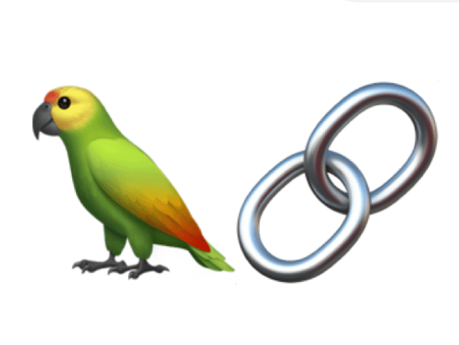

# Humor Chat

The Humor Chatbot API is a playful project designed to inject humor into everyday interactions. Built for entertainment purposes, this chatbot generates witty and amusing responses to user queries, adding a lighthearted touch to conversations. Accessible through a user-friendly API, developers can easily integrate the chatbot into their target systems, enhancing user experiences with a dash of humor.

## Project Design 


## Key Features:

***Witty Responses***: The chatbot generates clever and humorous answers to user queries, providing a delightful experience for users seeking entertainment.

***API Integration***: The chatbot is exposed through a simple API, allowing developers to seamlessly integrate it into their applications, websites, or chat platforms.


## Setting Up the Humor Chat in Local

Follow these steps to set up the Fun Chatbot API in your system:

1. **Clone the Repository:**
    ```bash
    git clone <repository_url>
    cd humor-chat
    python -m venv <venv-name>
2. **On Windows**
    ```bash
    <venv-name>\Scripts\activate
    ```
3. **On macOS/Linux**
    ```bash
    source <venv-name>/bin/activate
    ```
4. **Install dependencies**
    ```
    pip install -r requirements.txt
    ```
5. **Start the server**
    ```
    uvicorn app:app --reload
    ```
### Interactive API docs
***

Now go to <a href="http://127.0.0.1:8000/docs" class="external-link" target="_blank">http://127.0.0.1:8000/docs</a>.

You will see the automatic interactive API documentation (provided by <a href="https://github.com/swagger-api/swagger-ui" class="external-link" target="_blank">Swagger UI</a>):

> ### Query :


> ### Response 1:

> ### Response 2. 


### Built using :
***
<div style="display: flex; flex-direction: column; justify-content: center; align-items: center;">
    
    
    
    
</div>

***
